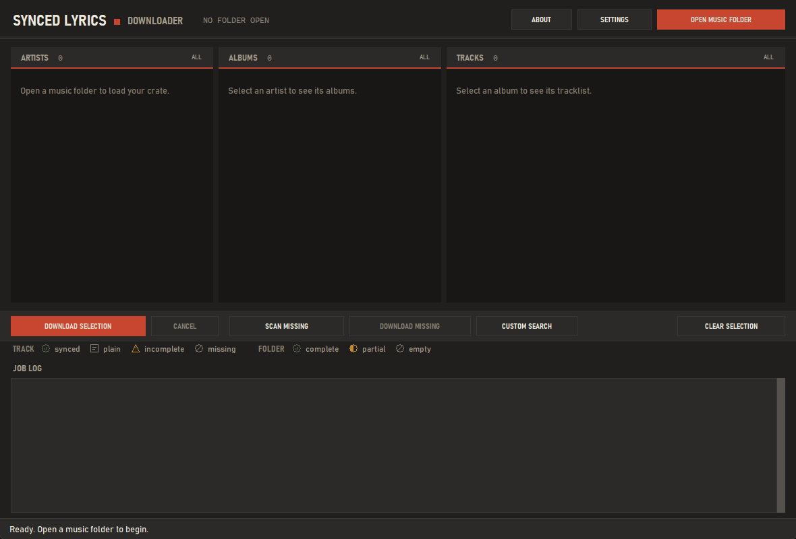
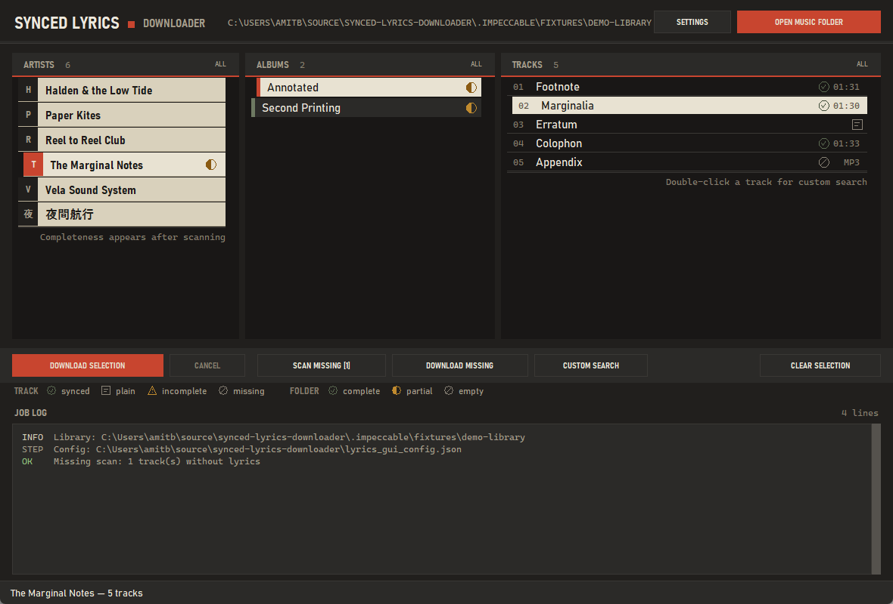
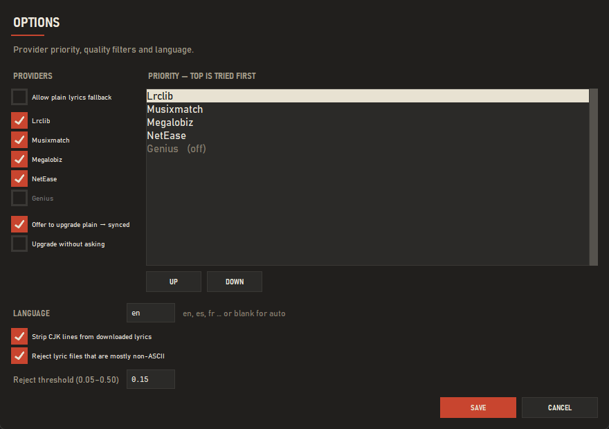
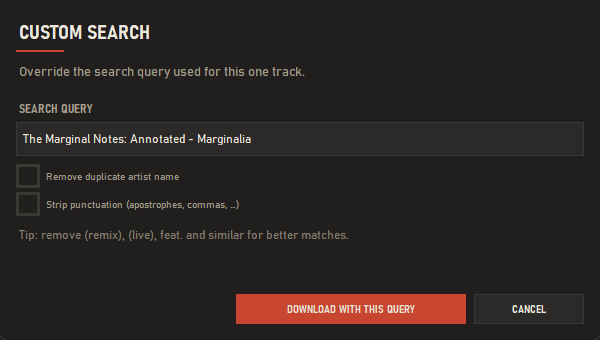
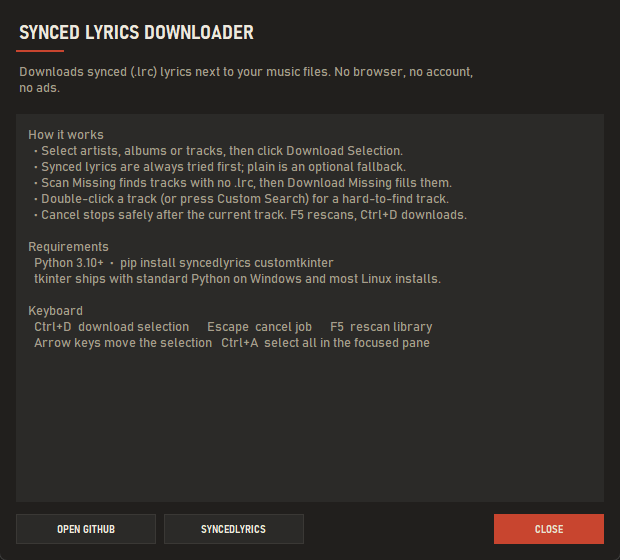

# 🎵 Synced Lyrics Downloader

A desktop GUI app for downloading synced (`.lrc`) lyrics for your local music library. Built with Python and tkinter — no internet browser required, no accounts, no ads.


---

## Screenshots

**First run** — the crate before a folder is opened.



**Main window** — artist dividers on the left, album spines behind them, and the selected record's tracklist stamped with its lyric state.



**Settings** — provider priority, quality filters and language.



**Custom Search** — override the query for tracks the providers get wrong.



**About** — version and project links.



*Captured on Windows against the synthetic demo library in `.impeccable/fixtures`.*

---

## Features

- **Synced lyrics first** — always tries `.lrc` with timestamps before falling back to plain text
- **Everything saved as `.lrc`** — maximum compatibility with all media players
- **Multiple providers** — Lrclib, Musixmatch, Megalobiz, NetEase, Genius (configurable priority)
- **Smart scanning** — scan selection for missing lyrics, download only what's missing
- **Custom Search** — override the search query for hard-to-find tracks
- **Auto-upgrade** — detects plain `.lrc` files and offers to find a synced version
- **State marks, drawn not emoji** — ✅ synced · 📄 plain · ⚠️ incomplete · ❌ missing, each a distinct vector silhouette so the state survives greyscale and colour-blindness
- **Folder completeness** — ✅ complete · 🟨 partly complete · ⬜ empty (shown after scanning)
- **One committed theme** — "The Crate": kraft board on a near-black crate ground
- **Keyboard shortcuts** — `Ctrl+D` download · `Escape` cancel · `F5` refresh
- **Double-click a track** to open Custom Search instantly
- **Remembers window size and position** between sessions
- **CJK stripping** and non-ASCII rejection to avoid garbage results
- Works great on **network drives** (NAS, mapped drives)

---

## Requirements

### Windows
```
Python 3.10+      →  https://python.org/downloads
syncedlyrics      →  pip install syncedlyrics
customtkinter     →  pip install customtkinter
tkinter           →  included with standard Python install
```

### Linux
```
Python 3.10+      →  sudo apt install python3
syncedlyrics      →  pip install syncedlyrics
customtkinter     →  pip install customtkinter
tkinter           →  sudo apt install python3-tk
```

---

## Installation

```bash
# 1. Clone the repo
git clone https://github.com/amitbrown21/synced-lyrics-downloader.git
cd synced-lyrics-downloader

# 2. Install dependencies
pip install -r requirements.txt

# 3. Run
python lyrics_downloader_ultimate.py
```

---

## Project Structure

The application is split so the engine can run without a GUI:

```
lyrics_downloader_ultimate.py   runnable entry point (same command as before)
lyricsdl/
  config.py                     settings, provider lists, defaults
  library.py                    folder scanning, lyric-state detection, completeness cache
  providers.py                  provider fetching, CJK / non-ASCII filters
  downloader.py                 the download engine — thread-safe, no UI imports
  ui/
    theme.py                    design tokens (colours, metrics, font resolution)
    widgets.py                  crate widgets: canvas lists, drawn state marks, silk buttons
    dialogs.py                  Options, About, Custom Search, upgrade prompt
    app.py                      main window: selection, background jobs, shortcuts
tests/
  test_library.py               lyric parsing and state classification
  test_downloader.py            engine failure paths (runs offline)
docs/screenshots/               shipping screenshots
DESIGN.md                       the visual system
```

The screenshots are generated, not hand-cropped — rerun them after UI changes:

```bash
python .impeccable/tools/capture.py    # writes .impeccable/review/, then copy into docs/screenshots/
```

`lyricsdl/` imports no GUI code outside `lyricsdl/ui/`, so scanning and
downloading can be scripted or tested headlessly:

```python
from lyricsdl import downloader, library

missing = library.find_missing(["D:/Music"])
downloader.download_targets(
    missing, music_dir="D:/Music",
    reporter=downloader.Reporter(), cancel=lambda: False,
)
```

Run the self-checks with `python tests/test_library.py` and
`python tests/test_downloader.py`.

---

## Quick Start

1. Click **Open Music Folder** and point it at your music library
2. Select an **artist** from the left panel
3. Select **albums** and/or **tracks** (or use Select All)
4. Click **Download Lyrics For Selection**
5. Watch the log panel — done!

### Finding missing lyrics

1. Select one or more artists
2. Click **Scan Missing (Selection)** — shows count of tracks without lyrics
3. Click **Download Missing (Selection)** — downloads only what's missing

### Hard-to-find tracks

1. Select an artist and a **single track**
2. Click **Custom Search** (or double-click the track)
3. Edit the search query — try removing `(feat. ...)`, `(Live)`, `(Remix)` etc.
4. Use the checkboxes to remove duplicate artist names or strip punctuation
5. Click **Download using this query**

---

## Settings

Open **Settings** to configure:

| Option | Description |
|--------|-------------|
| Provider priority | Use **Up** / **Down** to reorder which providers are tried first |
| Enable/disable providers | Turn off providers that give bad results |
| Allow plain fallback | Enable Genius for plain text lyrics |
| Auto-upgrade plain → synced | Detect plain `.lrc` files and offer synced upgrade |
| Language | Preferred lyrics language code (e.g. `en`) |
| Strip CJK lines | Remove Chinese/Japanese/Korean lines from results |
| Reject mostly non-ASCII | Filter out results in wrong language |

---

## Library Structure

This app expects the standard 3-level folder structure:

```
Music/
  Artist/
    Album/
      01 Track.mp3
      02 Track.mp3
```

This is the default output of **MusicBrainz Picard**, **beets**, **Mp3tag**, and most music library managers. If your library is organized this way you're good to go.

---

## File Structure

The app saves lyrics **next to your music files**, with the same filename:

```
Music/
  Artist/
    Album/
      01 Track Name.mp3
      01 Track Name.lrc      ← synced lyrics (timestamped)
      02 Another Track.mp3
      02 Another Track.lrc   ← plain lyrics (no timestamps, still .lrc)
```

---

## Keyboard Shortcuts

| Shortcut | Action |
|----------|--------|
| `Ctrl+D` | Download lyrics for selection |
| `Escape` | Cancel current download |
| `F5` | Refresh library |
| `Double-click track` | Open Custom Search |

---

## Providers

| Provider | Synced | Plain | Notes |
|----------|--------|-------|-------|
| Lrclib | ✅ | ❌ | Best first choice, open source |
| Musixmatch | ✅ | ❌ | Good coverage |
| Megalobiz | ✅ | ❌ | Good for older tracks |
| NetEase | ✅ | ❌ | Large Asian library, may give non-English results |
| Genius | ❌ | ✅ | Plain text only, requires plain fallback enabled |

---

## Config File

Settings are saved automatically to `lyrics_gui_config.json` in the same folder as the script.

---

## Built With

- [Python](https://python.org) — runtime
- [tkinter](https://docs.python.org/3/library/tkinter.html) — windowing, canvas-rendered crate lists
- [CustomTkinter](https://github.com/TomSchimansky/CustomTkinter) — themed dialogs, scrollbars and controls
- [syncedlyrics](https://github.com/moehmeni/syncedlyrics) — lyrics fetching library

---

## License

MIT — do whatever you want with it.

