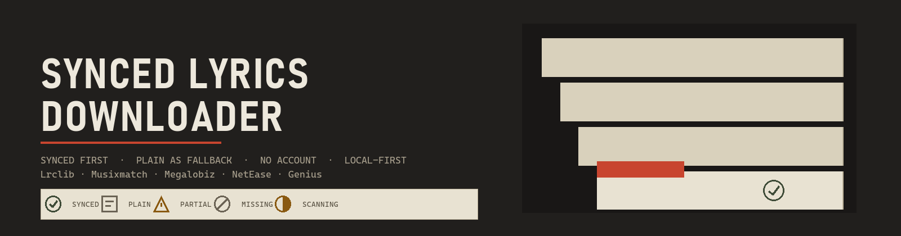
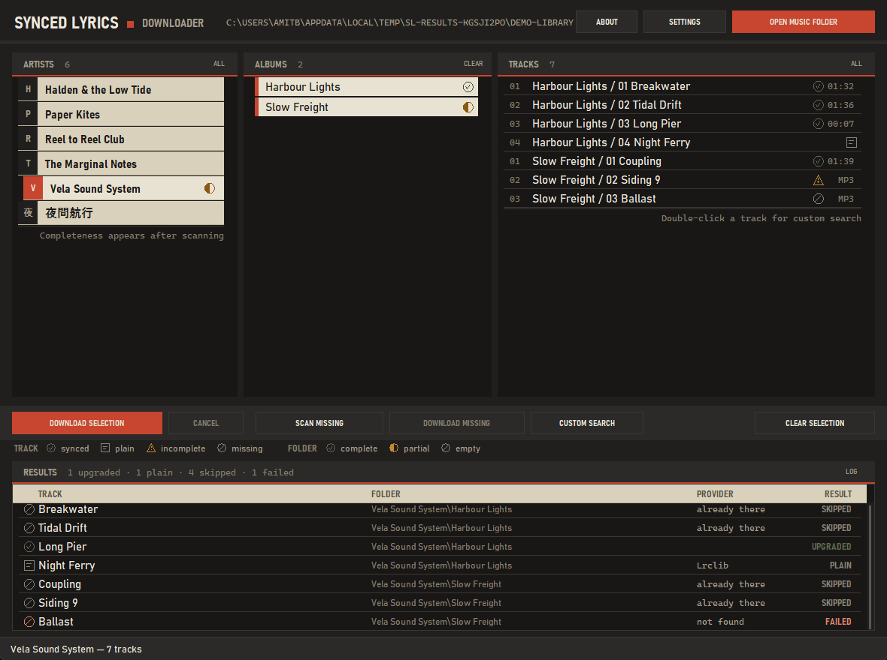

# Synced Lyrics Downloader



A desktop app for downloading synced (`.lrc`) lyrics for your local music library, built with Python and tkinter. It runs on your own machine, with no browser, no account and no ads.


---

## Download

The standalone Windows build lives on the [latest release](https://github.com/amitbrown21/synced-lyrics-downloader/releases/latest) page:

**`SyncedLyricsDownloader.exe`** is a single file and installs nothing. The lyrics engine travels inside it, so the machine does not need Python, `pip install` or `syncedlyrics`. When the `syncedlyrics` command is missing, the app calls the bundled copy in-process instead. Double-click it and the window opens.

Windows may warn about an unrecognised publisher on first launch, because the binary is not code-signed. Choose **More info → Run anyway**. Settings are saved next to the executable.

Running from source works too, as described under [Installation](#installation).

---

## Screenshots

**First run**: the crate before a folder is opened.


**Main window**: artist dividers on the left, album spines behind them, and the selected record's tracklist, each track carrying its lyric state at the right edge.


**Settings**: provider priority, quality filters and language.


**Custom Search**: overrides the query for tracks the providers get wrong.


**Results sheet**: one row per track, showing what landed and whether it is synced, plain or nothing. Lookups run several at a time, and rows settle in place as they return.



**About**: version and project links.


All screenshots were captured on Windows against the synthetic demo library in `.impeccable/fixtures`.

---

## Features

- Synced lyrics come first. The app asks for `.lrc` files with timestamps before it accepts plain text, then saves either one as `.lrc` for the widest player support.
- Lookups run in parallel: four tracks at once by default, between 1 and 16 in Settings, which keeps a large library from crawling.
- Providers are Lrclib, Musixmatch, Megalobiz, NetEase and Genius, tried in the order you set.
- The results sheet gives every track a row and names the outcome: synced, plain, upgraded, skipped or failed, plus the provider that answered.
- A scan finds which tracks in a selection have no lyrics, so you can download only what is missing. Plain `.lrc` files can be detected and upgraded to synced ones.
- Custom Search replaces the query when a provider keeps missing a track.
- State marks are drawn vector silhouettes, one shape per state, so the state survives greyscale and colour-blindness. Folder completeness appears after a scan.
- `Ctrl+D` downloads, `Escape` cancels, `F5` refreshes, and double-clicking a track opens Custom Search.
- Window size and position are remembered between sessions. CJK lines are stripped and mostly-non-ASCII results rejected, which keeps junk out of the library.
- Works on network drives such as a NAS or a mapped drive.
- The visual theme is "The Crate": kraft board on a near-black crate ground.

---

## Requirements

### Windows
```
Python 3.10+      →  https://python.org/downloads
syncedlyrics      →  pip install syncedlyrics
customtkinter     →  pip install customtkinter
tkinter           →  included with standard Python install
```

### Linux
```
Python 3.10+      →  sudo apt install python3
syncedlyrics      →  pip install syncedlyrics
customtkinter     →  pip install customtkinter
tkinter           →  sudo apt install python3-tk
```

---

## Installation

```bash
# 1. Clone the repo
git clone https://github.com/amitbrown21/synced-lyrics-downloader.git
cd synced-lyrics-downloader

# 2. Install dependencies
pip install -r requirements.txt

# 3. Run
python lyrics_downloader_ultimate.py
```

---

## Building the executable

```bash
pip install pyinstaller
python build_exe.py
```

This writes a single `dist/SyncedLyricsDownloader.exe` (~39 MB) with the GUI theme assets, the lyrics engine and the TLS certificates bundled in. The icon is drawn from the same design tokens as the UI, so it cannot drift from the palette, and the version stamped into the file comes from `lyricsdl.__version__`.

### Regenerating the art

One generator produces the app mark and every shipped raster:

```bash
python tools/make_art.py            # all art, then tests/test_art.py verifies it
python tools/make_art.py --icon     # just build/icon.ico
```

It writes `build/icon.ico` (one adaptive render per size, 16 through 256), the `docs/art/` set (the mark PNGs, the same mark as `icon.ico` for Windows to use as the window icon, the wordmark, the README hero and the 1280×640 social card) and `docs/art/provenance.json`. Nothing is hand-drawn, so nothing drifts from `lyricsdl/ui/theme.py`, and each PNG carries its provenance as metadata.

To check a build the way a user meets it, launch it and have it exercise its own engine and window:

```bash
python tests/test_exe.py
```

That runs the packaged app's `--selftest`, which does a real lookup, builds the real window against a miniature library, and writes a JSON report the test asserts on. The lookup needs the network, so it is reported but not required; everything else is asserted. `--selftest` also works on a source checkout.

---

## Project Structure

The application is split so the engine can run without a GUI:

```
lyrics_downloader_ultimate.py   runnable entry point (same command as before)
lyricsdl/
  config.py                     settings, provider lists, defaults
  library.py                    folder scanning, lyric-state detection, completeness cache
  providers.py                  provider fetching, CJK / non-ASCII filters
  downloader.py                 the download engine — thread-safe, no UI imports
  ui/
    theme.py                    design tokens (colours, metrics, font resolution)
    icon.py                     window and taskbar icon, and the app's taskbar identity
    widgets.py                  crate widgets: canvas lists, drawn state marks, silk buttons
    dialogs.py                  Options, About, Custom Search, upgrade prompt
    app.py                      main window: selection, background jobs, shortcuts
tests/
  test_library.py               lyric parsing and state classification
  test_downloader.py            engine paths: upgrades, cancellation, parallel lookups
  test_widgets.py               crate list interaction: rail clicks, drags, selection
  test_art.py                   generated art: contrast, clipping, icon sizes, provenance
  test_icon.py                  window and taskbar icon loading, identity, fallbacks
  test_exe.py                   the packaged app's own --selftest
tools/
  make_art.py                   generates the mark, icon, wordmark and social card
docs/screenshots/               shipping screenshots
docs/art/                       generated app art, with provenance.json
DESIGN.md                       the visual system
```

The engine runs in two phases: a sequential planning pass, which may raise the "upgrade to synced?" prompt and settles "Yes to all" in one place, then a thread pool that fetches several tracks at once. Each lookup shells out to the `syncedlyrics` CLI, so tracks are independent processes and nothing is shared except the reporter.

The screenshots are generated rather than hand-cropped, so rerun the capture after UI changes:

```bash
python .impeccable/tools/capture.py    # writes .impeccable/review/, then copy into docs/screenshots/
```

`lyricsdl/` imports no GUI code outside `lyricsdl/ui/`, so scanning and downloading can be scripted or tested headlessly:

```python
from lyricsdl import downloader, library

missing = library.find_missing(["D:/Music"])
downloader.download_targets(
    missing, music_dir="D:/Music",
    reporter=downloader.Reporter(), cancel=lambda: False,
)
```

Run the self-checks with `python tests/test_library.py` and
`python tests/test_downloader.py`.

---

## Quick Start

1. Click **Open Music Folder** and point it at your music library
2. Select an **artist** from the left panel
3. Select **albums** and/or **tracks** (or use Select All)
4. Click **Download Lyrics For Selection**
5. Watch the results sheet, where every track reports what it got

### Finding missing lyrics

1. Select one or more artists
2. Click **Scan Missing (Selection)** to count the tracks without lyrics
3. Click **Download Missing (Selection)** to fetch only what's missing

### Hard-to-find tracks

1. Select an artist and a **single track**
2. Click **Custom Search**, or double-click the track
3. Edit the search query. Removing `(feat. ...)`, `(Live)` or `(Remix)` usually helps
4. Use the checkboxes to remove duplicate artist names or strip punctuation
5. Click **Download using this query**

---

## Settings

Open **Settings** to configure:

| Option | Description |
|--------|-------------|
| Provider priority | Use **Up** / **Down** to reorder which providers are tried first |
| Enable/disable providers | Turn off providers that give bad results |
| Allow plain fallback | Enable Genius for plain text lyrics |
| Auto-upgrade plain → synced | Detect plain `.lrc` files and offer synced upgrade |
| Language | Preferred lyrics language code (e.g. `en`) |
| Strip CJK lines | Remove Chinese/Japanese/Korean lines from results |
| Reject mostly non-ASCII | Filter out results in wrong language |
| Parallel lookups | How many tracks are fetched at once (1 to 16, default 4) |

---

## Library Structure

This app expects the standard 3-level folder structure:

```
Music/
  Artist/
    Album/
      01 Track.mp3
      02 Track.mp3
```

This is the default output of **MusicBrainz Picard**, **beets**, **Mp3tag** and most music library managers. If your library is organized this way you're good to go.

---

## File Structure

The app saves lyrics **next to your music files**, with the same filename:

```
Music/
  Artist/
    Album/
      01 Track Name.mp3
      01 Track Name.lrc      ← synced lyrics (timestamped)
      02 Another Track.mp3
      02 Another Track.lrc   ← plain lyrics (no timestamps, still .lrc)
```

---

## Keyboard Shortcuts

| Shortcut | Action |
|----------|--------|
| `Ctrl+D` | Download lyrics for selection |
| `Escape` | Cancel current download |
| `F5` | Refresh library |
| `Double-click track` | Open Custom Search |

---

## Providers

| Provider | Synced | Plain | Notes |
|----------|--------|-------|-------|
| Lrclib | Yes | No | Best first choice, open source |
| Musixmatch | Yes | No | Good coverage |
| Megalobiz | Yes | No | Good for older tracks |
| NetEase | Yes | No | Large Asian library, may give non-English results |
| Genius | No | Yes | Plain text only, requires plain fallback enabled |

---

## Config File

The app saves your settings to `lyrics_gui_config.json`, in the same folder as the script.

---

## Built With

- [Python](https://python.org) for the runtime
- [tkinter](https://docs.python.org/3/library/tkinter.html) for windowing and the canvas-rendered crate lists
- [CustomTkinter](https://github.com/TomSchimansky/CustomTkinter) for themed dialogs, scrollbars and controls
- [syncedlyrics](https://github.com/moehmeni/syncedlyrics) for fetching lyrics

---

## License

MIT. Do whatever you want with it.
